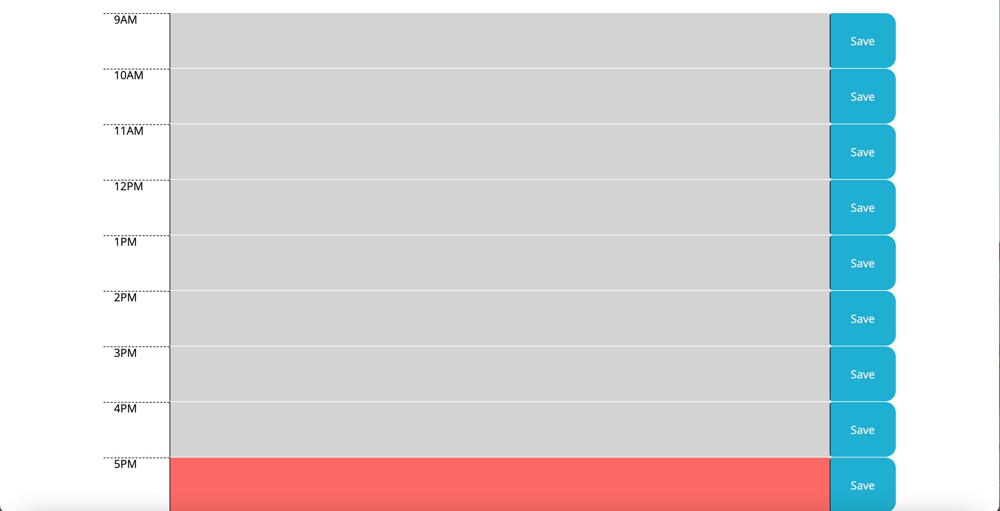
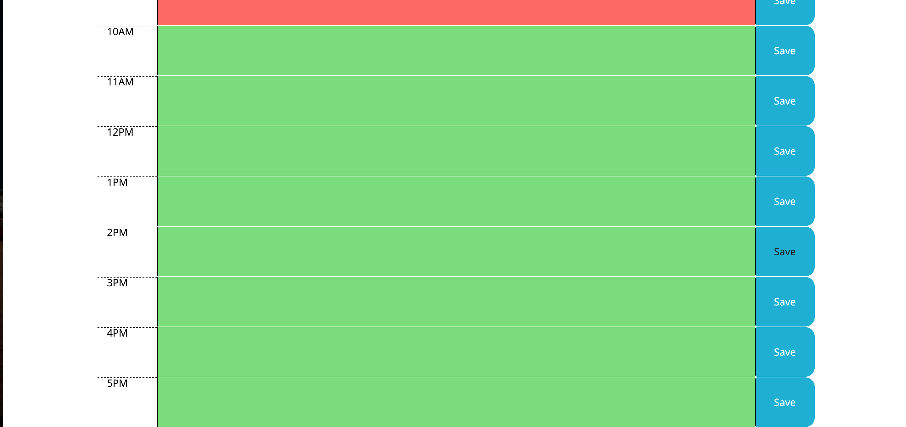

# daily-planner

This is a daily planner tool. It displays the current day and also hours of the workday. The hours are color coded for the day. Hours that have past appear grey, The current hour is red, and future hours are green.

Here is the working planner: https://pdavisdu.github.io/daily-planner/